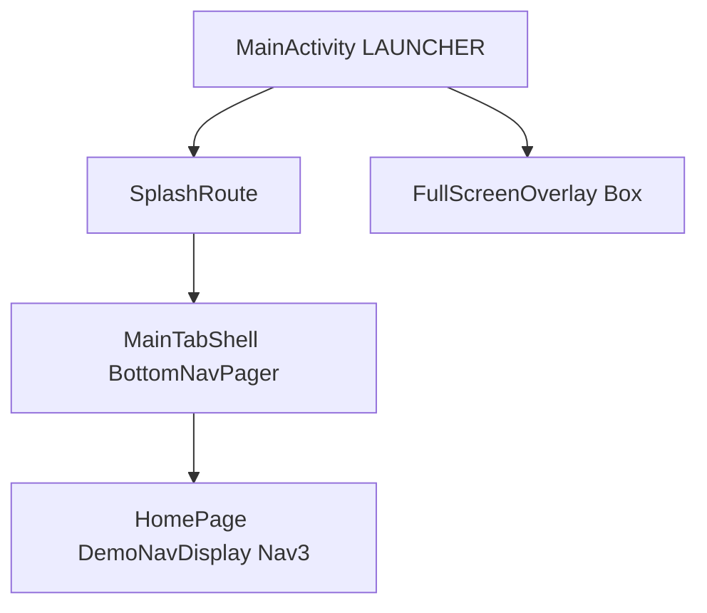

# Compose 演示应用：架构与数据流

本文描述 **CommonLib / app** 演示工程的单 Activity 结构、Navigation 3 与全屏层的关系，以及 **Flow / Saveable / BaseComposeViewModel** 的职责划分。

## 1. 启动与界面层级

1. **`MainActivity.setComposeContent()`**  
   根据 `rootPhase` 在 **闪屏**（`SplashRoute`）与 **主导航**（`MainTabShell`）之间切换。

2. **`MainTabShell`**（`MainActivity.kt` 内私有 Composable）  
   使用 **`BottomNavPager`** 展示三个 Tab：首页（`HomePage`）、我的、拦截调试等。

3. **`HomePage`**  
   主体为 **`DemoNavDisplay`**：`rememberNavBackStack(DemoActionList)` + **`NavDisplay`**（含前进/返回/预测返回的纵向过渡）。

4. **全屏覆盖层**  
   `AppShellController` + **`CompositionLocalProvider(LocalAppShell)`**；`overlayState` 为 `FullScreenOverlay` 时，在 `MainActivity` 根 `Box` 上叠加 **AgentWeb** / **TestComposeDemo** 等，仍属同一 Activity。

## 2. Navigation 3 与状态

- **返回栈**：`NavBackStack` 持有可序列化的 **`NavKey`**（见 `DemoNavDestinations.kt`），描述「有哪些屏及参数」。
- **页面内 UI 状态**（计数、输入草稿）：使用 **`rememberSaveable`** 或 common_core 提供的 **`rememberSaveableIntState` / `rememberSaveableStringState`**（`ComposeSavedState.kt`），与 Nav 栈正交；复杂状态用 **ViewModel** + **`SavedStateHandle`**。

演示入口：**首页列表 →「生命周期 + Saveable + Flow」**（`LifecycleSavedStateDemoPage`）。

## 3. Flow 与生命周期

- **`collectAsStateWithLifecycleWhileStarted`**（`common_core`：`ComposeFlowLifecycle.kt`）  
  将 `Flow`/`StateFlow` 转为 Compose **`State`**，仅在 **`Lifecycle.State.STARTED`** 及以上收集；进入后台后取消收集，避免无效更新。

- **`BaseComposeViewModel`**（`common_core`：`BaseComposeViewModel.kt`）  
  在 **`repeatOnLifecycle(STARTED)`** 内用 **`snapshotFlow`** 订阅 **`apiExceptionState`**，与网络请求异常提示对齐；**不引入 Hilt**。

## 4. 模块与文件索引

| 关注点 | 位置 |
|--------|------|
| 单 Activity / 闪屏 / Tab / 覆盖层 | `app/.../ui/MainActivity.kt`、`AppShell.kt` |
| Nav3 列表与路由表 | `app/.../navigation/DemoNavDisplay.kt`、`DemoNavDestinations.kt` |
| 生命周期 + Saveable 示例 | `app/.../ui/compose/LifecycleSavedStateDemoPage.kt`、`ui/viewmodel/LifecycleDemoViewModel.kt` |
| Flow 收集封装 | `common_core/.../helper/compose/ComposeFlowLifecycle.kt` |
| Saveable 小工具 | `common_core/.../helper/compose/ComposeSavedState.kt` |
| 请求页包装 | `common_core/.../base/mvvm/BaseComposeViewModel.kt` |

## 5. 演示列表维护说明

- 已从主导航移除 **Accompanist Placeholder** 示例，并去掉 **`common_core`** 对 `accompanist-placeholder` 的依赖（权限等仍使用 `accompanist-permissions`）。
- **Carousel** 实现位于 `app/.../ui/compose/CarouselExamples.kt`。
- **跳转互传参数** UI 位于 `NavigateParamsViews.kt`。
